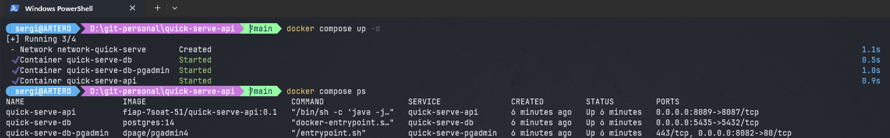

# Projeto Tech Challenge - Fase 1
<details>
<summary>Clique aqui para expandir a documentação da fase 1</summary>

## Docker
Segue abaixo passo a passo para rodar o projeto com docker

1. Instale o docker para o seu sistema operacional
2. Certifique-se de que o docker compose também esteja instalado
3. Crie um arquivo .env, com o conteúdo do arquivo .env-docker-compose-sample e preencha as informações conforme seu ambiente. Abaixo um exemplo de preenchimento:


3. Via terminal, entre no diretório raiz do projeto quick-server-api
4. Digite: docker compose up -d



### Serviços configurados

> <b>quick-serve-api</b>
>
>       Serviço do projeto back-end desenvolvido em Java, que servem as APIs da aplicação
>
> <b>quick-serve-db</b>
>
>       Serviço do banco de dados postgres
>
> <b>quick-serve-pgadmin</b>
>
>       Serviço do app pgadmin, para acessarmos o banco de dados através de uma interface amigável


### Documentação Swagger

Após subir a API, a documentação Swagger ficará disponibilizado em:


>       http://localhost:30081/swagger-ui/index.html#/


</details>


# Projeto Tech Challenge - Fase 2

<details>
<summary>Clique aqui para expandir a documentação da fase 2</summary>

## Docker
Build da imagem
```
docker build -t arterodocker/quick-serve-api:2.0.0 .
```

Publicação no Docker Hub
```
docker push arterodocker/quick-serve-api:2.0.0
```

## Kubernetes
Considerando que o Kubernetes está ativo na maquina que irá rodar a aplicação, estes são os comandos para subir a aplicação no Kubernetes.
No video disponibilizado, tem mais detalhes de como utilizar:
```
cd ./pods
kubectl apply -f configmap-quick-serve-api.yaml
kubectl apply -f configmap-quick-serve-db.yaml
kubectl apply -f secret-quick-serve-api.yaml
kubectl apply -f secret-quick-serve-db.yaml
kubectl apply -f pv-postgres.yaml
kubectl apply -f pvc-postgres.yaml
kubectl apply -f postgres.yaml
kubectl apply -f quick-serve-api.yaml
kubectl apply -f svc-postgres.yaml
kubectl apply -f svc-quick-serve-api.yaml
kubectl apply -f metrics.yaml
kubectl apply -f hpa.yaml
```

## Entregáveis do item 1 do Tech Challenge
É o código deste repositório na branch <b>main</b>

## Entregáveis do item 2 do Tech Challenge
Arquitetura Kubernetes: Link do Miro: https://miro.com/app/board/uXjVKQTr4vM=/

Os arquivos .yaml de configuração do Kubernetes estão em [./pods](pods)

Onde:

<b>configmap-quick-serve-api.yaml:</b> Pod de variaveis de ambiente para API
<br><b>configmap-quick-serve-db.yaml::</b> Pod de variaveis de banco de dados Postgres
<br><b>secret-quick-serve-api.yaml:</b> Pod com variaveis de conteúdo sensível para API
<br><b>secret-quick-serve-db.yaml:</b> Pod com variaveis de conteúdo sensível para banco de dados Postgres
<br><b>pv-postgres.yaml:</b> Pod para configurar volume total a ser controlado pelo Kubernetes
<br><b>pvc-postgres.yaml:</b> Pod para configurar volume para a aplicação, baseado no volume total
<br><b>postgres.yaml:</b> Pod para subir o postgres dado a imagem do registry. No caso está sendo utilizado o Docker Hub
<br><b>quick-serve-api.yaml:</b> Pod para subir a API desenvolvida dado a imagem do registry. No caso está sendo utilizado o Docker Hub
<br><b>svc-postgres.yaml:</b> Pod do serviço do banco de dados, conectado ao pod que controla o postgres
<br><b>svc-quick-serve-api.yaml:</b> Pod do serviço da API, conectado ao pod que controla o container do back-end
<br><b>metrics.yaml:</b> Pod com a configuração de métricas e informações do hostserver
<br><b>hpa.yaml:</b> Pod de dimensionamento de escalabilidade do pod de API, baseado nas métricas

## Entregáveis do item 3 do Tech Challenge

### Requisitos de negócio e de Infraestrutura
Link do Miro: https://miro.com/app/board/uXjVKQTr4vM=/

### Postman Collection
Disponibilizado o arquivo json em [postman_collection.json](docs%2Fpostman_collection.json)

### Guia completo com todas as instruções para execução do projeto e a ordem da execução das APIs
Link do video com o passo a passo e demonstração de uso das APIs: https://youtu.be/q1Q6vLJ4Pic


</details>